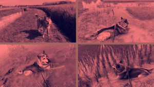

Using Python and ImageMagick, image files are arranged in tiles according to certain rules.

## Prerequisite:

- All images must be the same size  
The image size is checked in the script.
- Install ImageMagick beforehand  
I am not using Python's ImageMagick library, but am using `subprocess.run(['magick', ...], ...)`.  
It uses ImageMagick ver.7 syntax.


## Usage:

I think it would be better to create a batch file and run it rather than specifying the files one by one from the console and executing them in real time.  
Check `create_tiles.sh`.

|Arguments|Default|Remarks|
|---|---|---|
|Input image files||The order has meaning|
|Output image file|||
|`tyling_type`||`6tiles`, `5tiles`, `4tiles`, `landscape`, `portrait`|
|`gap_size`|`10`||
|`gap_color`|`#00000000`||


### 6 tiles


```
+-----+--+
|    6| 1|
|     |  |
|     +--+
|     | 2|
|     |  |
+--+--+--+
| 5| 4| 3|
|  |  |  |
+--+--+--+
```

```
python3 ./create_tiles.py \
  ./images/IMG_1709.png \
  ./images/IMG_1794.png \
  ./images/IMG_2300.png \
  ./images/IMG_2443.png \
  ./images/IMG_2811.png \
  ./images/IMG_3038.png \
  ./IMG_6tiles..large.png \
  --tyling_type 6tiles \
  --gap_size 20 \
  --gap_color '#72170faa'
```


### 5 tiles


```
+-----+---+
|    5|  1|
|     |   |
|     |   |
|     +---+
+--+--+  2|
| 4| 3|   |
|  |  |   |
+--+--+---+
```

```
python3 ./create_tiles.py \
  ./images/IMG_1709.png \
  ./images/IMG_1794.png \
  ./images/IMG_2300.png \
  ./images/IMG_2443.png \
  ./images/IMG_2811.png \
  ./IMG_5tiles..large.png \
  --tyling_type 5tiles \
  --gap_size 20 \
  --gap_color '#72170faa'
```


### 4 tiles



```
+---+---+
|  4|  1|
+---+---+
|  3|  2|
+---+---+
```

```
python3 ./create_tiles.py \
  ./images/IMG_1709.png \
  ./images/IMG_1794.png \
  ./images/IMG_2300.png \
  ./images/IMG_2443.png \
  ./IMG_4tiles..large.png \
  --tyling_type 4tiles \
  --gap_size 20 \
  --gap_color '#72170faa'
```


### Landscape


```
+---+---+...+---+
|  1|  2|   |  n|
+---+---+...+---+
```

```
python3 ./create_tiles.py \
  ./images/IMG_1709.png \
  ./images/IMG_1794.png \
  ./images/IMG_2300.png \
  ./IMG_landscape..large.png \
  --tyling_type landscape \
  --gap_size 20 \
  --gap_color '#72170faa'
```


### Portrait


```
+---+
|  1|
+---+
|  2|
+---+
.   .
+---+
|  n|
+---+
```

```
python3 ./create_tiles.py \
  ./images/IMG_1709.png \
  ./images/IMG_1794.png \
  ./images/IMG_2300.png \
  ./IMG_portrait..large.png \
  --tyling_type portrait \
  --gap_size 20 \
  --gap_color '#72170faa'
```


## Todo:

1. Add logic to specify a directory containing image files, rather than specifying individual files
1. Option to set large images to the top right, bottom right, top left, and bottom left, instead of just the top left, such as 6tile
1. Optional framing?
1. Porting to Fish shell functions

